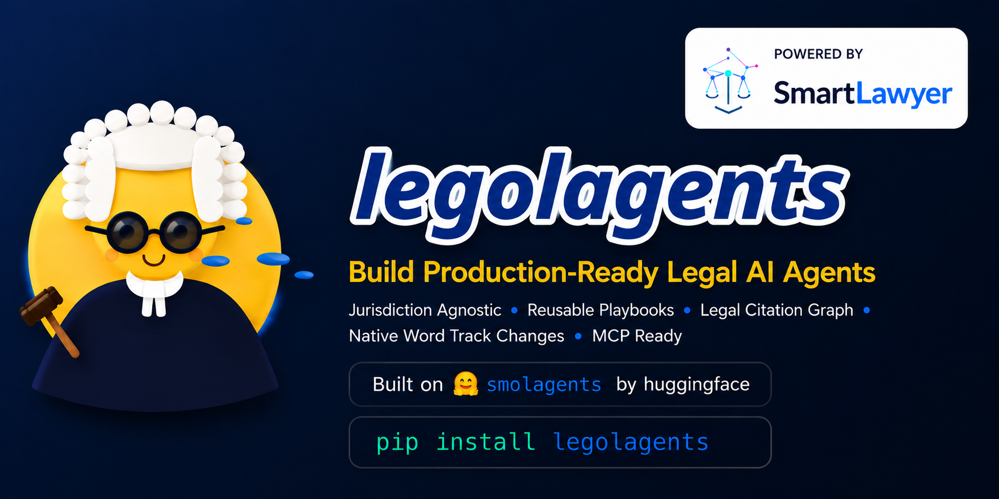

<div align="center">
  

[](https://pypi.org/project/legolagents/)
[](LICENSE)
[]()
[](https://github.com/huggingface/smolagents)

[Version française](README.fr.md)

</div>

---

**legolagents** extends [smolagents](https://github.com/huggingface/smolagents) with structured legal reasoning — jurisdiction-agnostic by default.

You already have smolagents. Add legolagents and your agents apply a jurist's protocol, whatever the applicable law: they check whether a decision is still valid before citing it, walk the citation lineage, detect overturned rulings, and revise your contracts with native Word tracked changes. Set a jurisdiction (`jurisdiction="France"`, `"Belgium"`…) to ground it in a given legal system — or leave it generic if you're plugging in your own multi-jurisdiction database.

```bash
pip install legolagents
```

---

## What actually changes

**Without legolagents**, a smolagents agent answers a legal question by keyword search. It might cite a decision that was overturned three years ago without knowing it.

**With legolagents**, the agent automatically applies a jurist's protocol:
it checks the validity of each decision, distinguishes landmark decisions from case-specific ones, walks citations across several levels, and flags divergences between courts or jurisdictions.

---

## The pattern

```python
from legolagents import SourceType, Authority, LegalSource

statute = LegalSource(ref="L1235-3", type=SourceType.STATUTE, authority=Authority.BINDING)
case    = LegalSource(ref="21-14.027", type=SourceType.CASE_LAW, authority=Authority.PERSUASIVE)
case.relates_to(statute, how="interprets")
```

Every legal system on earth mixes codified sources (statutes, regulations, treaties) and case law — what actually changes from one jurisdiction to the next is **authority**, not **type**. A court decision is `PERSUASIVE` in a civil law country, `BINDING` in a common law one — same `SourceType.CASE_LAW` either way. This is the vocabulary the reasoning strategy, the tools, and the citations all share: set the authority ranking once per jurisdiction, and the rest of the framework adapts. See [`legolagents.ontology`](src/legolagents/ontology.py) for the full model (source types, authority levels, and the relation types — cites, interprets, applies, distinguishes, overturns, supersedes, implements).

---

## Quickstart (any jurisdiction)

legolagents doesn't assume any database or any legal system — you plug in your own tools:

```python
from legolagents import LegalResearchAgent
from legolagents.tools.retrieval import JurisprudenceSearchTool
from smolagents import LiteLLMModel

class MySearchTool(JurisprudenceSearchTool):
    def forward(self, query: str, domaine: str = "", limit: int = 5) -> str:
        results = my_database.search(query)
        return self.format_results(results)

model = LiteLLMModel(model_id="anthropic/claude-sonnet-4-5")
agent = LegalResearchAgent(
    tools=[MySearchTool()],
    model=model,
    jurisdiction="France",   # or "Belgium", "Quebec"… or empty (generic)
)
print(agent.run("What is the case law on wrongful termination of a sale agreement?"))
```

The agent automatically checks the validity of decisions, walks the citation graph, and answers with a certainty level: `✅ Established law`, `⚡ Trending`, `⚠️ Isolated`, or `❌ Superseded`.

Don't have a case law database yet? See the [Example: bootstrapping on the French market](#example-bootstrapping-on-the-french-market-smartlawyer-mcp) section below — a ready-to-use MCP connector to try the framework without building anything.

---

## Playbooks — a workflow in one line

```python
from legolagents.playbooks import Playbook

Playbook.quick("NDA Review", points=[
    "Parties — who are the contracting parties?",
    "Term — how long does the confidentiality obligation last?",
    "Carve-outs — what information is excluded from confidentiality?",
]).register()
```

`Playbook.quick(...).register()` builds and registers a structured analysis workflow in one call — points accept plain `"Label — description"` strings, `id` and document type are inferred from the title. Then hand it to any document agent:

```python
from legolagents import LegalDocumentAgent
from legolagents.playbooks import PlaybookLibrary

agent    = LegalDocumentAgent(model=model)
playbook = PlaybookLibrary.get("nda_review")
agent.run(f"Document: my_nda.docx\n\n{playbook.to_prompt()}")
```

For full control (flag conditions, custom output format, extra instructions), `Playbook` and `PlaybookPoint` remain available directly — see the built-in French-law playbooks below for an example.

---

## Other examples

### Contract revision with Accept / Reject in Word

```python
from legolagents import LegalDocumentAgent

agent = LegalDocumentAgent(model=model, jurisdiction="France", legal_domain="employment law")
agent.review(
    "contract.docx",
    "The non-compete clause has no financial consideration — fix it",
    output_path="contract_revised.docx",
)
# → open in Word or LibreOffice → Accept / Reject each change
```

No full document regeneration. The agent surgically edits the relevant clauses and injects native Word tracked-change tags (`<w:del>` / `<w:ins>`).

### Structured analysis of a commercial lease (French law example)

```python
from legolagents import LegalDocumentAgent
from legolagents.playbooks import PlaybookLibrary

agent    = LegalDocumentAgent(model=model, jurisdiction="France")
playbook = PlaybookLibrary.get("bail_commercial")  # 14 points, French Commercial Code L145
agent.run(f"Document: lease.docx\n\n{playbook.to_prompt(output_path='analysis.docx')}")
# → Word report: termination clause without formal notice ⚠️, unlawful property tax pass-through ⚠️…
```

### Comparing N documents across M criteria

```python
agent.compare(
    ["lease_A.docx", "lease_B.docx", "lease_C.docx"],
    criteria=["Term", "Indexation", "Termination clause", "Tenant charges"],
    output_path="due_diligence.docx",
)
# → matrix with automatic flagging of risky clauses
```

---

## Plug in your own database

legolagents defines interfaces — you implement `forward()` for your backend, in any language or jurisdiction:

```python
from legolagents.tools.retrieval import JurisprudenceSearchTool

class MyTool(JurisprudenceSearchTool):
    def forward(self, query: str, domaine: str = "", limit: int = 5) -> str:
        results = my_database.search(query)
        return self.format_results(results)
```

Works with Qdrant, Elasticsearch, a REST API, or any legal MCP server.

---

## Example: bootstrapping on the French market (SmartLawyer MCP)

Don't have a case law database yet? [SmartLawyer MCP](https://mcp.smartlawyer.ai) gives access to **1M+ French court decisions** and **13 Legal Graph tools** — handy for prototyping a legolagents project without building anything. **Free developer tier.**

```bash
pip install 'legolagents[mcp]'
```

```python
from legolagents import LegalResearchAgent
from legolagents.mcp import SmartLawyerMCP

with SmartLawyerMCP(api_key="sk-sl-your-key") as tools:
    agent = LegalResearchAgent(tools=tools, model=model, jurisdiction="France")
    agent.run("Is decision 17-19.860 still valid?")
```

→ [Get a free API key](https://smartlawyer.ai) · [MCP documentation](https://smartlawyer.ai/mcp/)

This connector is one example among other possible legal MCP servers (see "Plug in your own database" above) — the core of the framework doesn't depend on it.

Want a full chat UI instead of a script? [`examples/06_chainlit_smartlawyer_chatbot.py`](examples/06_chainlit_smartlawyer_chatbot.py) wires the same agent into a working [Chainlit](https://chainlit.io) chatbot in about 15 lines.

---

## Available playbooks (French law examples)

| ID | Document | Analysis points |
|---|---|---|
| `bail_commercial` | Commercial lease | 14 (French Commercial Code L145-1) |
| `contrat_travail` | Employment contract (CDI/CDD) | 12 (French Labor Code) |
| `pacte_associes` | Shareholders' agreement | 15 |
| `convention_credit` | Credit agreement | 18 |

These playbooks ship ready-to-use for the French market; write your own with `Playbook.quick(...)` (see above) for any other jurisdiction or document type.

---

## Contributing

Issues and PRs welcome — additional playbooks, new tool interfaces, support for other jurisdictions (Belgium, Switzerland, Quebec, common law…).

---

## License

Apache 2.0 · Built by [SmartLawyer AI](https://smartlawyer.ai)
