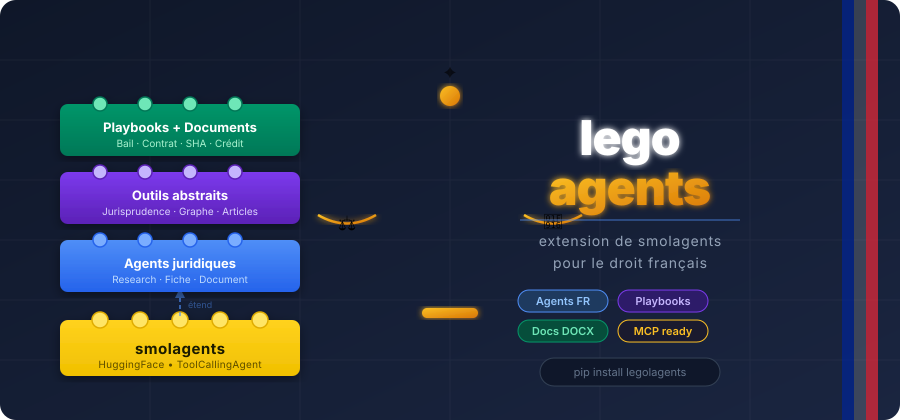

<div align="center">
  

[](https://pypi.org/project/legolagents/)
[](LICENSE)
[]()
[](https://github.com/huggingface/smolagents)

</div>

---

**legolagents** étend [smolagents](https://github.com/huggingface/smolagents) pour le droit français.

Vous avez déjà smolagents. Ajoutez legolagents et vos agents comprennent le droit français : ils vérifient si un arrêt est toujours valide avant de le citer, remontent la lignée jurisprudentielle, détectent les revirements, et révisent vos contrats avec le suivi des modifications Word natif.

```bash
pip install legolagents
```

---

## Ce que ça change concrètement

**Sans legolagents**, un agent smolagents répond à une question juridique en cherchant des mots-clés. Il peut citer un arrêt renversé depuis 3 ans sans le savoir.

**Avec legolagents**, l'agent applique automatiquement le protocole d'un juriste :
vérifie la validité de chaque arrêt, distingue les arrêts de principe des arrêts d'espèce, remonte les citations sur plusieurs niveaux, et signale les divergences entre chambres.

---

## Exemples

### Recherche jurisprudentielle

```python
from legolagents import LegalResearchAgent
from legolagents.mcp import SmartLawyerMCP  # ou branchez votre propre base
from smolagents import LiteLLMModel

model = LiteLLMModel(model_id="anthropic/claude-sonnet-4-5")

with SmartLawyerMCP(api_key="sk-sl-...") as outils:
    agent = LegalResearchAgent(tools=outils, model=model)
    print(agent.run("Le barème Macron est-il toujours constitutionnel ?"))
```

L'agent vérifie automatiquement la validité des arrêts, remonte le graphe de citations, et répond avec un niveau de certitude : `✅ Droit établi`, `⚡ Tendance`, `⚠️ Isolé`, ou `❌ Superseded`.

---

### Révision de contrat avec Accept / Rejeter dans Word

```python
from legolagents import LegalDocumentAgent

agent = LegalDocumentAgent(model=model, legal_domain="droit social")
agent.review(
    "contrat.docx",
    "La clause de non-concurrence n'a pas de contrepartie financière — la corriger",
    output_path="contrat_révisé.docx",
)
# → ouvrir dans Word ou LibreOffice → Accept / Rejeter chaque modification
```

Pas de régénération du document entier. L'agent modifie chirurgicalement les clauses concernées et injecte les balises Word natives (`<w:del>` / `<w:ins>`).

---

### Analyse structurée d'un bail commercial

```python
from legolagents import LegalDocumentAgent
from legolagents.playbooks import PlaybookLibrary

agent    = LegalDocumentAgent(model=model)
playbook = PlaybookLibrary.get("bail_commercial")  # 14 points L145 C.com.
agent.run(f"Document : bail.docx\n\n{playbook.to_prompt(output_path='analyse.docx')}")
# → rapport Word : clause résolutoire sans mise en demeure ⚠️, taxe foncière illégale ⚠️…
```

---

### Comparaison de N contrats sur M critères

```python
agent.compare(
    ["bail_A.docx", "bail_B.docx", "bail_C.docx"],
    criteres=["Durée", "Indexation", "Clause résolutoire", "Charges locataires"],
    output_path="due_diligence.docx",
)
# → matrice avec signalement automatique des clauses à risque
```

---

## Brancher votre propre base de données

legolagents définit des interfaces — vous implémentez le `forward()` pour votre backend :

```python
from legolagents.tools.retrieval import JurisprudenceSearchTool

class MonOutil(JurisprudenceSearchTool):
    def forward(self, query: str, domaine: str = "", limit: int = 5) -> str:
        resultats = ma_base.rechercher(query)
        return self.format_results(resultats)  # formatage FR intégré
```

Fonctionne avec Qdrant, Elasticsearch, une API REST, ou n'importe quel MCP juridique.

---

## Obtenir des données jurisprudentielles

Si vous n'avez pas de base jurisprudentielle, le [MCP SmartLawyer](https://mcp.smartlawyer.ai) donne accès à **1M+ arrêts français** et **13 outils Legal Graph**. **Mode développeur gratuit.**

```bash
pip install 'legolagents[mcp]'
```

```python
from legolagents.mcp import SmartLawyerMCP

with SmartLawyerMCP(api_key="sk-sl-votre-cle") as outils:
    agent = LegalResearchAgent(tools=outils, model=model)
    agent.run("L'arrêt 17-19.860 est-il toujours valide ?")
```

→ [Obtenir une clé gratuite](https://smartlawyer.ai) · [Documentation MCP](https://mcp.smartlawyer.ai)

---

## Playbooks disponibles

| Identifiant | Document | Points d'analyse |
|---|---|---|
| `bail_commercial` | Bail commercial | 14 (L145-1 C.com.) |
| `contrat_travail` | Contrat CDI/CDD | 12 (Code du travail) |
| `pacte_associes` | Pacte d'associés | 15 |
| `convention_credit` | Convention de crédit | 18 |

---

## Contribuer

Issues et PR bienvenus — playbooks supplémentaires, nouvelles interfaces d'outils, support juridictions francophones (Belgique, Suisse, Québec).

---

## Licence

Apache 2.0 · Construit par [SmartLawyer AI](https://smartlawyer.ai)
